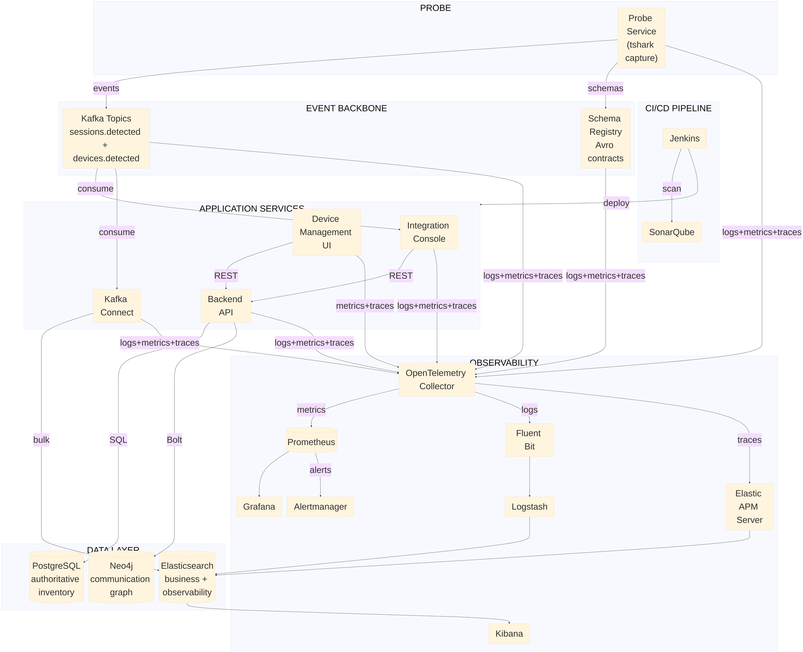

# 000 - Architecture Overview (High-level)

## Goal

Provide a single high-level view of the platform structure, showing clear layers and the
event-driven backbone.

## High-level Architecture

## Key flows

Edge labels stay deliberately short so the diagram renders narrow and legible. The full
detail behind each label is:

- Probe publishes `sessions.detected` / `devices.detected` as Avro and validates them against Schema Registry; Backend publishes its own domain events the same way.
- Integration Console and Kafka Connect consume those topics as independent consumer groups.
- `REST` edges are HTTPS with JSON payloads. `SQL` is PostgreSQL over TCP 5432, `Bolt` is the Neo4j driver protocol, and `bulk` is the Elasticsearch bulk HTTP API.
- Every runtime component exports OTLP telemetry, including Probe and Kafka. Backend, Console, Connect, Probe, Kafka, and Schema Registry emit all three signals over OTLP/gRPC; the browser UI emits metrics and traces over OTLP/HTTP.
- Observability splits into two legs from the Collector: metrics through `Prometheus -> Grafana` with `Alertmanager` for alerting, and logs/traces through `Logstash` and `APM Server` into Elasticsearch, with Kibana as the read surface.
- Jenkins builds and deploys the application services and runs SonarQube for code quality.

See `xxx-application-observability-stack.md` for the detailed service-level version.

## Event-driven characteristics

- **Asynchronous core**: business flow is decoupled through Kafka topics.
- **Contract-first events**: Avro schemas in Schema Registry govern event compatibility.
- **Independent consumers**: Integration Console and Connect evolve independently from producers.
- **Resilient ingestion**: capture, publication, consumption, and persistence are split into separate runtime responsibilities.

## Related

- `docs/adr/0013-definitive-observability-stack.md`
- `specs/007-device-communication-graph/spec.md`
- `specs/008-observability/spec.md`
