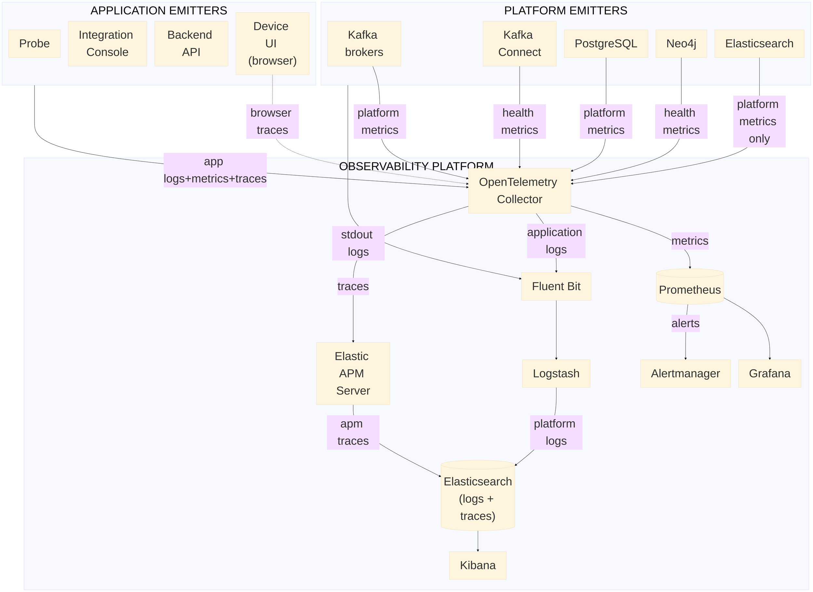

# 002 - Observability (High-level)

## Key flows

Edge labels are intentionally short for readability. At this level, the diagram captures these
observability paths:

- Application telemetry is emitted through OpenTelemetry instrumentation in authored services; browser telemetry contributes client-side traces to the same collector entry point.
- Platform telemetry is split by signal type: selected platform components expose metrics to Collector receivers, while selected platform logs are collected from container standard output through `Fluent Bit -> Logstash`.
- Elasticsearch is intentionally excluded from centralized platform log collection to avoid a self-referential logging cycle; its health is observed through metrics instead.
- Metrics are centralized through `OpenTelemetry Collector -> Prometheus`, then consumed in `Grafana`; alert evaluation in Prometheus is routed through `Alertmanager`.
- Logs and traces converge in Elasticsearch through two routes: platform logs through `Fluent Bit -> Logstash`, and traces through `Elastic APM Server`; Kibana is the read surface for investigation.

## Scope note

This is a high-level topology view. It intentionally omits low-level parsing/enrichment details
(for example multiline handling, redaction rules, index templates, and receiver-specific tuning).
For definitive implementation rationale and trade-offs, see `docs/adr/0013-definitive-observability-stack.md`.

